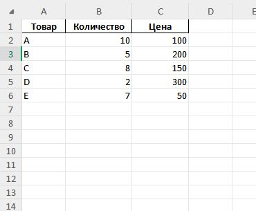
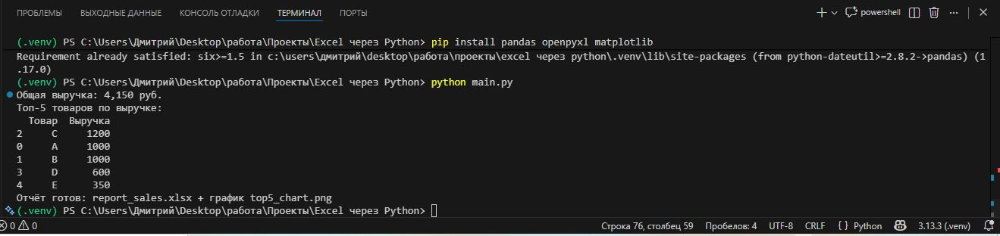
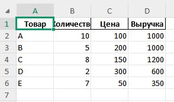

# Автоматизация Excel через Python

Скрипт для обработки данных продаж: расчёт выручки, топ-5 товаров, график и экспорт отчёта.

## Как работает
- Чтение Excel (pandas + openpyxl).
- Автоматическая нормализация колонок (фиксит "оличество", "ена" и пробелы).
- Расчёт выручки.
- Топ-5 товаров.
- График с числами (matplotlib).
- Отчёт в новый Excel (2 листа).

## Как запустить локально
1. `python -m venv .venv`
2. Активируй: `.\.venv\Scripts\Activate.ps1` (Windows PowerShell).
3. `pip install -r requirements.txt`
4. `python main.py`

Если файла нет — скрипт создаст тестовый.

## Пример результата

## Файлы
- `main.py` — основной скрипт.
- `input_sales.xlsx` — пример входных данных.
- `report_sales.xlsx` — готовый отчёт.
- `top5_chart.png` — график.

Технологии: Python, pandas, matplotlib, openpyxl.

Готов адаптировать под ваши данные (финансы, аналитика, CRM) — пишите @MaslDmitriy!

Лицензия: MIT
